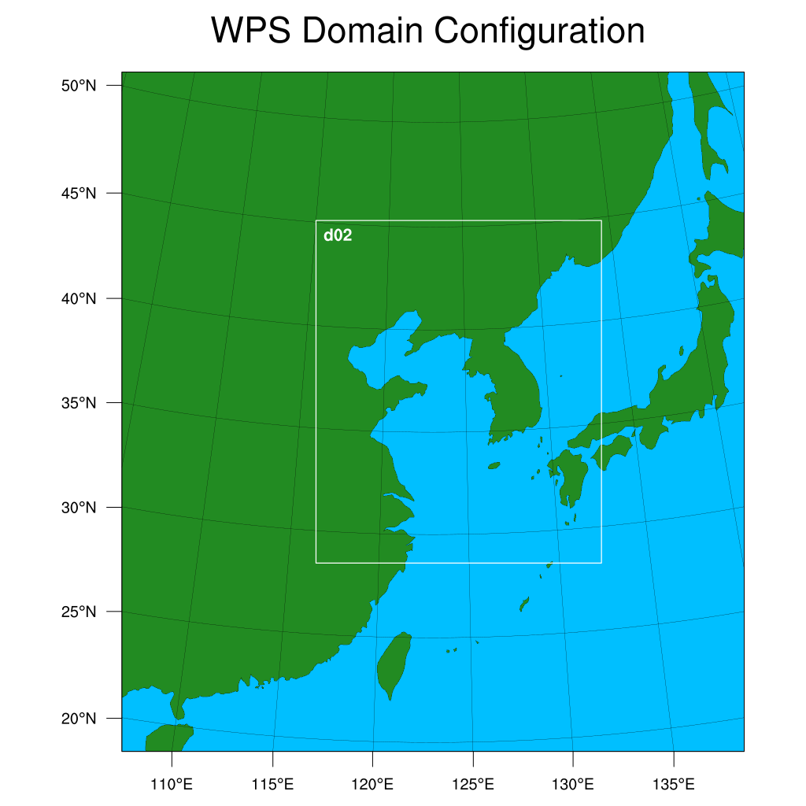

Quick start
###########

A simple simulation will be used to teach you how to use ``wrfrun`` to control WRF.

Concept of wrfrun context
*************************

Before we call executable files of WRF, there will be a lot jobs ``wrfrun`` needs to do:

* Read ``wrfrun`` config file, prepare the logger, read namelist template files, etc.
* Create an empty directory or clean the existed directory in which ``wrfrun`` will call executable files of WRF.
* Link essential files to the directory.
* Backup configurations of ``wrfrun`` and WRF's namelists, so you can possibly reproduce the simulation without ``wrfrun``.
* Automatically download essential data for WRF.
* ...

Besides, ``wrfrun`` also has some work to finish during and after the simulation. To make things more convenient, we introduce the concept of ``WRFRun`` context. All jobs mentioned above will be done on entering and exiting the context, while the usage of ``WRFRun`` is very simple:

.. code-block:: Python

    from wrfrun import WRFRun

    with WRFRun("./config.yaml", init_workspace=True, start_server=True, pbs_mode=True):
        # You are in wrfrun context
        ...

    # You are out of wrfrun context
    ...

.. note::
    Check the :doc:`../documentation/context` page for more information about the context

Prepare config file
*******************

The config file is a YAML-formatted file which contains configurations for ``wrfrun`` and some basic settings for WRF. For more information about the config file, please see :doc:`../documentation/config_file`.

By specifying a non-existent config file path and just entering ``WRFRun`` context without doing anything, ``wrfrun`` will copy the template file to the corresponding path.

.. code-block:: Python
    :caption: main.py

    from wrfrun import WRFRun

    with WRFRun("./config.yaml", init_workspace=False, start_server=False, pbs_mode=False) as server:
        pass

.. code-block::

    ERROR    wrfrun :: Config file doesn't exist, copy template config to ./config.yaml
    ERROR    wrfrun :: Please modify it.

Change the config for WRF simulation, we'll simulate a marine fog case from ``2021-03-24 12:00:00`` to ``2021-03-26 00:00:00``.

.. dropdown:: Click to show full config

    .. code-block:: yaml

        # The following settings will be used to run WPS and WRF
        wrf:

          # Set your WPS, WRF and WRFDA path here.
          wps_path: '/home/liurw/Apps/WPS'
          wrf_path: '/home/liurw/Apps/WRF'
          wrfda_path: '/home/liurw/Apps/WRFDA'

          # Set your geographical data path here
          # It will be used as "geog_data_path" in namelist.wps
          geog_data_path: '/home/liurw/Documents/geog_data'

          # Specify your WPS input data folder path here
          wps_input_data_folder: './test/data/bg'

          # Specify your Near GOOS data folder path here
          near_goos_data_folder: './test/data/sst'

          # Your can give your custom namelist files here
          # The value in it will overwrite the default value in py-wrfrun's namelist template file
          user_wps_namelist: ''
          user_real_namelist: ''
          user_wrf_namelist: ''
          user_wrfda_namelist: ''

          # It is OK to set debug_level larger than 100. You will need to check details is WRF crash.
          # And of course, who cares logs if WRF finished successfully?
          debug_level: 10

          time:
            # Set the start date, end date
            start_date: '2021-03-24 12:00:00'
            end_date: '2021-03-26 00:00:00'
            # Set input data time interval. Unit: seconds
            input_data_interval: 10800
            # Set output data time interval. Unit: minutes
            output_data_interval: 180
            # Note that there are various reasons which could crash wrf,
            # and in most cases you can deal with them by decrease time step.
            # Unit: seconds
            time_step: 120
            # Time ratio to the first domain for each domain
            parent_time_step_ratio: [1, 3, 4]
            # Time interval to write restart file. This help you can restart WRF after it stop.
            # By default it equals to output_data_interval. Unit: minutes.
            restart_interval: -1

          domain:
            # Set domain number
            domain_num: 2
            # It's very hard to process wrf domain settings because it's related to various settings, so I keep it
            # Remember to check area settings with wrfrun function `plot_domain_area` before submit to PBS (May not be completed now)
            # Resolution ratio to the first domain
            parent_grid_ratio : [1, 3]
            # Index of the start point
            i_parent_start : [1, 35]
            j_parent_start : [1, 34]
            # Number of point
            e_we : [110, 151]
            e_sn : [120, 181]
            # Resolution of the first domain
            dx : 30000
            dy : 30000
            # Projection
            map_proj :
              name: 'lambert'
              # For lambert projection
              truelat1 : 20.0
              truelat2 : 50.0
            # Central point of the first area
            ref_lat : 36.0
            ref_lon : 123.0
            stand_lon : 123.0

          # This section is used to specify various physics scheme for wrf
          scheme:

            # Here's the option of long wave scheme
            # "off": off,
            # "rrtm": RRTM,
            # "cam": CAM,
            # "rrtmg": RRTMG,
            # "new-goddard": New Goddard,
            # "flg": FLG,
            # "rrtmg-k": RRTMG-K,
            # "held-suarez": Held-Suarez,
            # "gfdl": GFDL
            long_wave_scheme:
              name: 'rrtm'
              # Option contains many other settings related to the scheme.
              # Sometimes some option can only be used for specific scheme.
              # You can check it in online namelist variables: https://www2.mmm.ucar.edu/wrf/users/wrf_users_guide/build/html/namelist_variables        .html
              # You can set option with its `wrf name` and its `wrf value`
              # For example, `ghg_input=1` works with rrtm scheme. If you want set `ghg_input=1` when using rrtm, set option: {"ghg_input": 1}
              # However, sometimes some options work with various scheme, and some options themselves are schem.
              # Use this carefully.
              # You can set multiple keys in option.
              option: {'icloud': 1}

            # Here's the option of short wave scheme
            # "off": off,
            # "dudhia": Dudhia,
            # "goddard": Goddard,
            # "cam": CAM,
            # "rrtmg": RRTMG,
            # "new-goddard": New Goddard,
            # "flg": FLG,
            # "rrtmg-k": RRTMG-K,
            # "gfdl": GFDL
            short_wave_scheme:
              name: 'rrtmg'
              option: {}

            # Here's the option of cumulus scheme
            # "off": off,
            # "kf": Kain-Fritsch (KF),
            # "bmj": BMJ,
            # "gf": Grell-Freitas,
            # "old-sas": Old SAS,
            # "grell-3": Grell-3,
            # "tiedtke": Tiedtke,
            # "zmf": Zhang-McFarlane,
            # "kf-cup": KF-CuP,
            # "mkf": Multi-scale KF,
            # "kiaps-sas": KIAPS SAS,
            # "nt": New Tiedtke,
            # "gd": Grell-Devenyi,
            # "nsas": NSAS,
            # "old-kf": Old KF
            cumulus_scheme:
              name: 'kf'
              option: {}

            # Here's the option of PBL scheme
            # "off": off,
            # "ysu": YSU,
            # "myj": MYJ,
            # "qe": QNSE-EDMF,
            # "mynn2": MYNN2,
            # "acm2": ACM2,
            # "boulac": BouLac,
            # "uw": UW,
            # "temf": TEMF,
            # "shin-hong": Shin-Hong,
            # "gbm": GBM,
            # "eeps": EEPS,
            # "keps": KEPS,
            # "mrf": MRF
            pbl_scheme:
              name: 'ysu'
              option: {'ysu_topdown_pblmix': 1}

            # Here's the option of land surface model
            # "off": off,
            # "slab": 5-layer thermal diffusion (SLAB),
            # "noah": Noah,
            # "ruc": RUC,
            # "noah-mp": Noah-MP,
            # "clm4": Community Land Model Version 4 (CLM4),
            # "px": Pleim-Xiu,
            # "ssib": Simplified Simple Biosphere (SSiB)
            land_surface_scheme:
              name: 'noah'
              option: {}

            # Here's the option of surface layer scheme
            # "off": off,
            # "mm5": revised MM5 Monin-Obukhov,
            # "mo": Monin-Obukhov (Janjic Eta Similarity),
            # "qnse": QNSE,
            # "mynn": MYNN,
            # "px": Pleim-Xiu; use with Pleim-Xiu surface and ACM2 PBL,
            # "temf": TEMF,
            # "old-mm5": old MM5
            surface_layer_scheme:
              name: 'mm5'
              option: {}

        # The following settings are general settings.
        wrfrun:

          # Specify where to save py-wrfrun log file
          log_path: './logs'

          # Specify the socket ip and port to start socket server
          # You can send any message to this server to check if wrfrun is still running,
          # and how much time has been used, running progress of wrfrun.
          socket_host: "localhost"
          # Leave port to 0 to let system determine it.
          # You can get the port number in log file.
          socket_port: 54321

          # Settings for PBS
          PBS:

            # Specify how many nodes you will use
            node_num: 1

            # Specify how many cores each node you will use
            core_num: 20

            # Specify custom environment settings here
            env_settings: {'LD_LIBRARY_PATH': '/usr/local/intel_2015/HDF5/lib:/home/liurw/.local/lib64:/home/liurw/.local/usr/lib:/home/liurw/        .local/usr/lib64:/usr/local/intel_2015/netcdf4/lib::/usr/local/intel_2015/intel/lib/intel64:/usr/local/intel_2015/openmpi/lib        :/usr/local/intel_2015/netcdf3/lib:/usr/local/intel_2015/zlib/lib:/usr/local/intel_2015/HDF5/lib:/usr/local/intel_2015/nco/lib        :/usr/local/lib:/home/liurw/Apps/miniconda3/lib'}

            # Specify custom python interpreter here
            python_interpreter: '/home/liurw/.local/share/mamba/envs/python3.10/bin/python3.10'

          # Specify your data save path here, all the outputs from WPS, WRF and WRFDA will be copied and saved in it
          output_path: './outputs'

If you don't know whether the domain setting is set properly, just run the script again and ``wrfrun`` will draw the simulation domain using the built-in NCL script.

.. code-block::

    INFO     wrfrun :: The image of domain area has been saved to /home/liurw/Documents/WRF/2021-03-25/outputs/wps_show_dom.png
    WARNING  wrfrun :: Check the domain image, is it right?
    Is it right? [y/N]:

If the simulation domain is incorrect, just press the ``Enter`` button, ``wrfrun`` will exit to let you change the domain setting.

.. code-block::

    ERROR    wrfrun :: Change your domain setting and run again

If the region is set correctly, you can type ``y`` to continue.

Download input data
*******************

``wrfrun`` only supports using ``cdsapi`` to download the ERA5 data from `Climate Data Store <https://cds.climate.copernicus.eu/datasets>`_. If you want to use data from other sources, you will need to download it manually and put it in the corresponding directory.

If you want to use wrfrun to download data, you need to configure the `cdsapi token <https://cds.climate.copernicus.eu/how-to-api>`_ settings in advance. By setting the ``prepare_wps_data`` and ``wps_data_area`` parameters in ``WRFRun``, you can make wrfrun automatically download the required data.

.. code-block:: Python
    :caption: main.py

    from wrfrun import WRFRun

    # data area: 90°E - 180°E, 10°N - 70°N
    with WRFRun("./config.yaml", init_workspace=False, start_server=False,
                pbs_mode=False, prepare_wps_data=True, wps_data_area=(90, 180, 10, 70)) as server:
        pass

Running WPS
***********

Running WPS can be accomplished by calling the ``geogrid``, ``ungrib`` and ``metgrid``.

.. code-block:: Python
    :caption: main.py

    from wrfrun import WRFRun
    from wrfrun.model import geogrid, ungrib, metgrid

    with WRFRun("./config.yaml", init_workspace=False, start_server=False, pbs_mode=False) as server:
        geogrid()
        ungrib()
        metgrid()

After that, you can find all the logs and outputs of WPS in the directory ``outputs``, in which they are stored in separate subdirectories.

Running WRF
***********

.. code-block:: Python
    :caption: main.py

    from wrfrun import WRFRun
    from wrfrun.model import real, wrf

    with WRFRun("./config.yaml", init_workspace=False, start_server=False, pbs_mode=False) as server:
        real()
        wrf()

After that, you can also find all the logs and outputs of WRF in the directory ``outputs``, in which they are stored in separate subdirectories.
